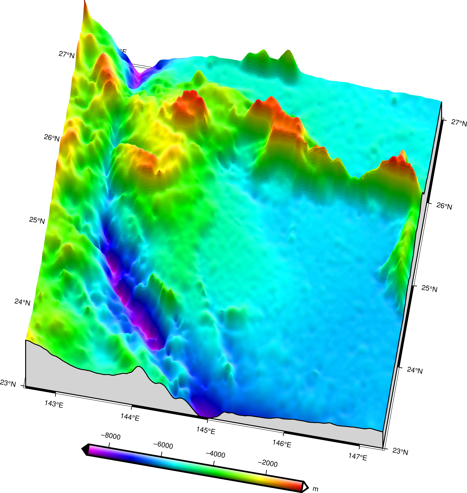

# gravity ocean depth (GOD)

## Introduction
使用重力地质法（ggm），以重力异常、船测水深为参数进行水深反演。

主要使用matlab＋gmt实现ggm算法。
## usage
result=GGM(free,control,check,d,range)

free为重力异常

control为控制水深点

check为检核水深点

d为参考深度

range为反演范围

result包含了所有的反演结果

result.stdinfo为最优密度差

output.rou为标准差

output.d为参考深度

output.detaD为反演水深点与检核点深度差值

output.rou_std_list为不同密度下相关系数和标准差
ggm.drd is the output result

## Plot
Use the `3d2.bat` to make 3D figure as shown in the top.
Use the `plot_plan.bat` to make 2D figure. 

## Bug
You may have the wrong message that the calculated parameters from GMT is not `stucture`. In that case, just remove the `.data` for all of the parameters got from GMT. For example, change the `control.data(:,1:2)` to `control(:,1:2)`. 

This bug may caused by GMT version changes.

## Citation
In preparation. 
## Contributor
This program is provided by [Wang Yongkang](https://github.com/orgs/GenericAltimetryTools/people/linfengaa).
## Acknowledgment
